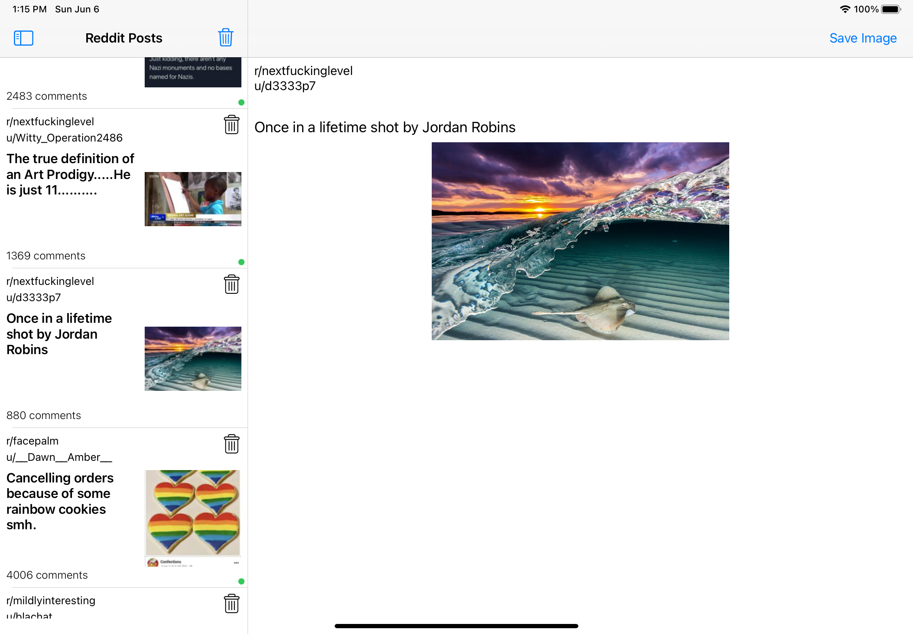

# Reddit Client

Reddit iOS Client

Main Features:
- Support for iPhone & Ipads
- Cache in-memory images downloaded for fast list scrolling
- Cache a list of posts into user defaults for the first fetch of data take the local one first
- Read indicator
- Pull to refresh functionality
- Pagination support
- Master details functionality
- Dismiss one post or the entire list

### Architecture

The app is using a MVVM pattern as a main architecture also using a fecture separation for the differents view controllers.

Folder structure:

RedditClient
  - Scenes
      - Feed
          - FeedViewContorller
          - FeedViewModel
      - PostDetails
          - PostDetailsViewController
          - PostDetailsViewModel
          - PostDetailsContentView
  - Views
      - RedditPostCell
            - RedditPostTableViewCell
            - RedditPostTableViewCellView
            - RedditPostViewModel
      - DialogHelper
  - Data
    - Models
    - ServiceClient
        - RedditServiceClient
    - Models
    
      ....
    - FacadeDataAccess
    - Constants
    - FetchImagesHelper
    - LocalDataAccess

| Iphone | Ipad |
|----------|:-------------:|
|  |  |
